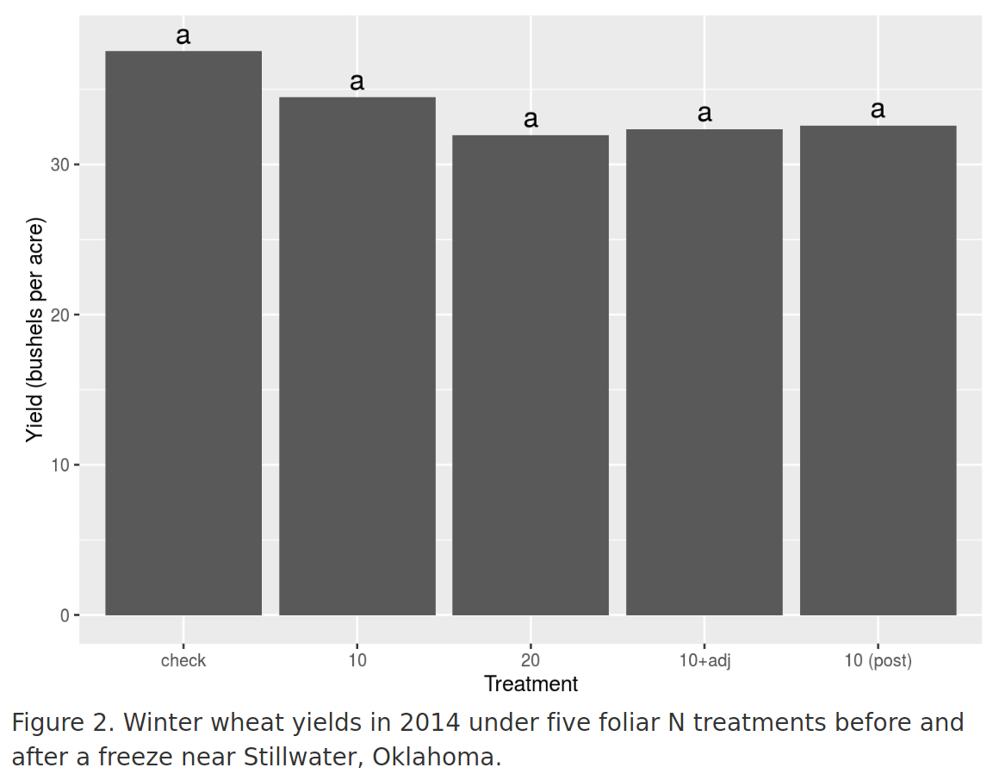
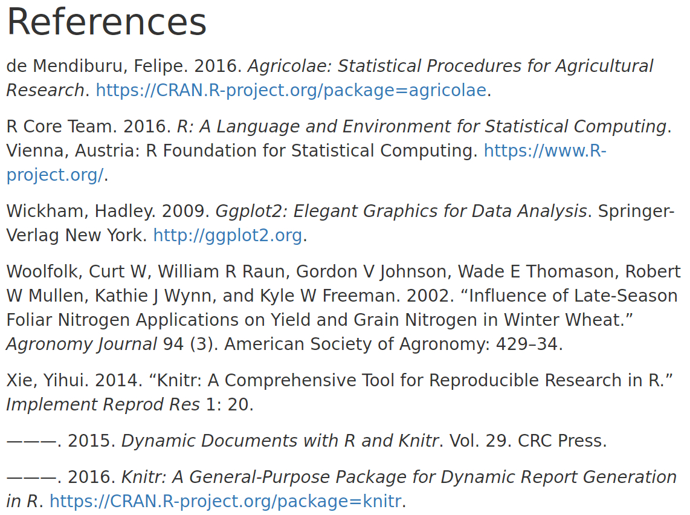

Suppose Dr. Raun has asked you to do some confirmatory analysis of some data from a study conducted to investigate the interactions between foliar N application and frost. The research question he wants you to answer is: how does pre- and post-freeze application of foliar N fertilizer affect freeze damage and recovery? You decide to put some of your new R skills to use and produce the report using R Markdown.

To do so, open a new R Markdown file within R Studio.  Use "Efaw Foliar N Freeze Mitigation Report" for the title and your name for the author.  The new file will contain an example template for an R Markdown document. Click on the **Knit HTML** button to compile your R Markdown document.  Compare the resulting output with the R Markdown script.  Read through the template R Markdown file and the resulting output for an explanation of how R Markdown works.

Next, create a subdirectory named data and download the data you will use ([Efaw_Freeze2014.xlsx](http://nue.okstate.edu/Experiment_Stations/Efaw_Freeze2014.xlsx)). Because the data are in an MS Excel spreadsheet, you will need to figure out how to read in the data. There are a number of tools for reading in want to use the handy `read_excel()` function to read in the data.  To do so, you will need to load the `readxl` R package first.

## Reading Data

 Within your R Markdown file, create a new R code block with the chunk name "read_data" that:

* Loads the `readxl` package using `library()` and reads in the data using the `read_excel()` function.  (*Hint: You will need to use sheet=1. Also, don't modify the Excel file to read it in.  Use the `range` argument within `read_excel()` to specify the cell ranges for the header row and data.*)

* Changes the variable for the change in NDVI to all positive values.

* Converts the treatment column from a numeric column to a factor column.

* Summarizes your data frame using the `summary()` function.

The displayed  R code and summary output are useful as you were checking that the data were read in properly, but you probably don't want them in your final report.  Use the `echo` and `include` options to the code chunk to keep these from being displayed in your document.

Below your "read_data" code chunk, add a header entitled **Introduction**
 to your document using the `##` notation and add a sentence below introducing the overall purpose of the report.


## Analyzing Data
 
 You now have all the data read into R and you are ready to begin your analysis. You consult with a colleague who has done this kind of work for Dr. Raun before and are delighted to discover that she uses R, too.  She shares a function with you that she wrote to automate parts of the analysis:

```
analyze <- function(formula,data){
  library(agricolae,quietly=TRUE)
  fit.lm <- lm(formula,data=data)
  fit.anova <- anova(fit.lm)
  fit.test <- LSD.test(y=data[,as.character(formula[[2]])],
                         trt=data[,as.character(formula[[3]])],
                         DFerror=tail(fit.anova$Df,1),
                         MSerror=tail(fit.anova$`Mean Sq`,1))
  return(fit.test$groups)
}
```

You notice that the function loads the `agricolae` package, which you have not used before. You make a note that you'll need to install it before you can use the function.

Add a section to your R Markdown file entitled **Results** and copy the function code into a new R code chunk with the name "define_analysis_function". Knit your document and inspect the output.  Set the code chunk options so that neither R code nor any output are displayed for this code chunk.

Create a new code chunk named "run_analysis" and add R code to use the `analyze()` function to calculate treatment means and mean groupings using Fisher's LSD for post-freeze decline in NDVI and harvested yield. Assign each of these to a separate object.  Set the code chunk options so that neither R code nor any output are displayed for this code chunk.

Use in-line R code chunks to write a sentence for each variable that states the minimum and maximum mean values for NDVI decline, rounded to the 2^nd^ decimal place, and for harvested yield, rounded to the nearest bushel.


## Adding Figures

Now that you have completed your quantitative analysis, you want to visualize the analysis for more user-friendly presentation.  You decide to use the `ggplot()` to create some bar graphs that will display the data.

* Add an R code chunk named "NDVI_plot" with the code needed to produce a barplot of the treatment means for the post-freeze NDVI decline. Be sure to label the axes appropriately.

* Use `geom_text()` to add labels to the bars to indicate significant differences between treatment means.  Use the `vjust`, `nudge_y`, and `size` arguments for `geom_text()` to size and position the labels appropriately.

* Add a sensible caption to the figure (including a figure number) using the `fig.cap` chunk option.


* Add a new R code chunk named "yield_plot" with R code to produce an equivalent figure for the yield data.  Be sure to include appropriate axis labels, bar labels for statistically significant differences, and a suitable figure caption.

* Set the `echo` chunk option for both code chunks so that no R code is
displayed in the final output.

* Add a sentence or two to your **Results** section describing the figures
and referencing them appropriately.



## Adding Tables

Because you are unsure how Dr. Raun will prefer the data to be presented, you decide to include the data in a table, as well.

* Within a new code chunk named "results_table", create a data frame that has columns with treatment means for post-freeze NDVI decline and yield.  Set the column names to "NDVI Decline" and "Yield". Set the row names to abbreviations for the corresponding treatments (i.e. not just treatment number).  (*Hint: I suggest you round the values appropriately and convert these to text using `format()`. You also will need to add a dash in your NDVI column for the missing treatment level*)

* Add the statistical significance labels to your results table using the
`str_c()` function.

* Modify your code to add Markdown notation to make the significance labels superscript.

* Use the `kable()` function to generate your table.

* Use the `caption` argument to the `kable()` function to add a suitable
caption for the results table.

* Set the code chunk options so that your R code is not displayed.


## Adding Citations

Your next steps as you write up your report are to document your methods with proper citations and to discuss your results while citing appropriate references. Fortunately, R Markdown provides a useful framework for handling citations. Create a new text file with R Studio using the name "bibliography.bib" (".bib" is the file extension for a BibTeX or BibLaTeX bibliography database).  This is where you will put the bibliographic information for each citation.

* Add a **Methods** section to your document and describe the basic methods used for your analysis. Be sure to mention that you used the R statistical programming language and mention the names of the R packages you used to analyze the data and produce the figures.

* In your console, type the command `citation()`.  The resulting output will include a BibTeX entry for R that begins with `@Manual` and is enclosed by curly brackets `{}`.  Copy the BibTeX entry into your "bibliography.bib" file and add a suitable citation key (such as `Rproject`) between the first `{` and the `,`.  Using the same citation key, add a citation to your R Markdown file in the **Methods** section immediately after where you mention using R.

* Return to the console and use the `citation()` function to generate BibTeX entries for each of the packages used in your analysis.  Add a unique citation key to each entry and use the key in your **Methods** section to cite each package appropriately.


* Within your R Markdown file, scroll to the end of the **Results** section and start a new section entitled **Discussion**.  You recall that Dr. Raun mentioned a paper he published on late-season foliar N application for wheat in 2002 so you decide to compare those results to your current results. Go to [Google Scholar](https://scholar.google.com) and search for the paper using the query `author:Raun late-season foliar nitrogen wheat`.  You are confident you will cite this paper, so click the `Cite` link under the appropriate entry in the search results.  Then click the `BibTeX` link at the bottom of the pop-out window.  Copy the resulting BibTeX entry into your "bibliography.bib" file. Feel free to change or shorten the citation key, if you like.

* Briefly read over the paper and write one or two sentences in the **Discussion** section comparing your results to those of the paper.  Be sure to include a citation for the paper.


* Once you knit your document, you notice that you've forgotten to add a header for the **References** section.  Add this as the last line of your R Markdown file.



